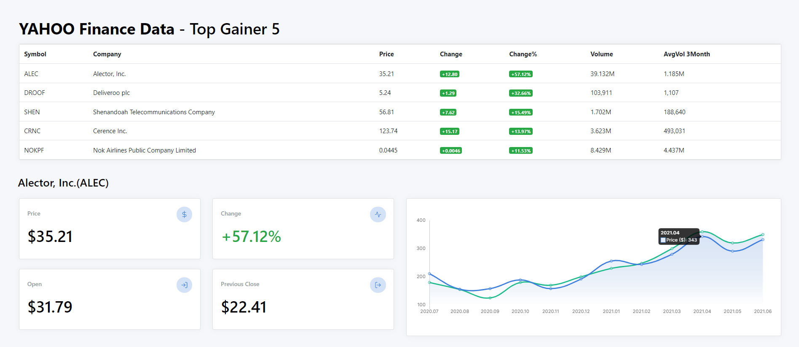
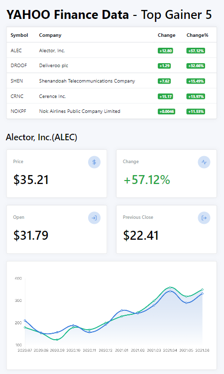

# Stock Data Analysis
### 실행화면



### 가상환경
>가상환경 실행하기  
>*Django개발은 반드시 가상환경을 키고 시작*  
`source myvenv/Scripts/activate`
>
>가상환경 끄기  
`deactivate`

>가상환경에 설치  
`pip install -r requirements.txt`
</br>

***

### Django  

>Django 서버 작동  
`python manage.py runserver`  
</br>

>Django DB 변경시 실행
```
python manage.py makemigrations 
python manage.py migrate
```

>Django DB admin생성
`python manage.py createsuperuser`

### Tip  

>Visual Studio Code 코드 자동정렬  
```
Ctrl + A 로 코드를 모두 선택한 후  
Ctrl 을 누른 상태에서 K 와 F 를 차례로 눌러줍니다  
```

### 참고
> 가상환경 생성 및 파이참 연결 : https://wikidocs.net/70588 <br/>
> Yahoo Finance 데이터 수집 : https://minjejeon.github.io/learningstock/2016/07/12/getting-data-from-yahoo-finance.html <br/>
> 주가 예측 딥러닝 모델 : https://dsstudy.tistory.com/10

